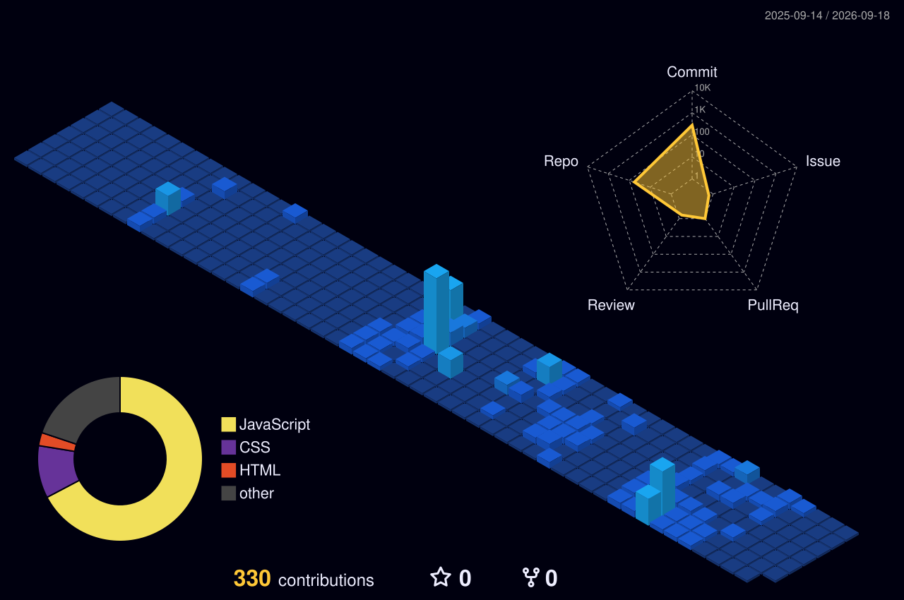

<!-- Tech Stack & Tooling Section -->
<h3 align="center">⚡ Tech Stack & Ecosystem</h3>

<!-- Core Languages & Frontend/Backend Stack -->

  

<!-- Cloud, DevOps & Tools -->

  

<h3 align="center">🎧 Currently Playing / Watching (Live)</h3>

  

<!-- Socials & Connect -->
<h3 align="center">🌐 Connect With Me</h3>

  
  
  

<h3 align="center">📊 Activity & Analytics</h3>

<table border="0" width="100%">
  <tr>
    <td width="50%" align="center" valign="top">
      
    </td>
    <td width="50%" align="center" valign="top">
       
    </td>
    <td width="50%" align="center" valign="top">
      
    </td>
  </tr>
</table>
